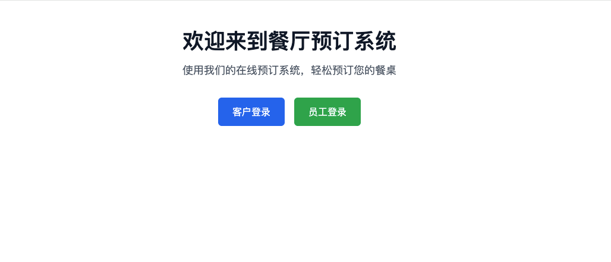
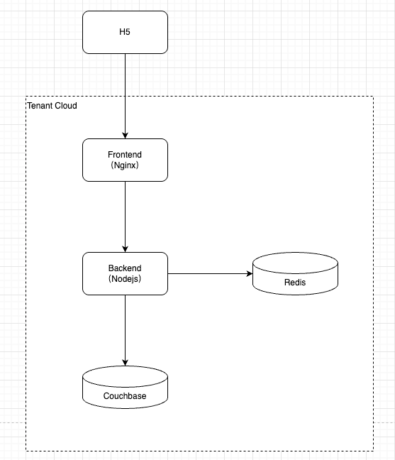

<p align="center">
  
</p>

<h1 align="center">Table Reservation System</h1>

<p align="center">
  <a href="https://nestjs.com" target="_blank"></a>
  <a href="https://www.typescriptlang.org" target="_blank"></a>
  <a href="https://www.couchbase.com" target="_blank"></a>
  <a href="https://redis.io" target="_blank"></a>
  <a href="https://graphql.org" target="_blank"></a>
  <a href="https://www.solidjs.com" target="_blank"></a>
</p>

<p align="center">
  <strong>基于 NestJS + Solid.js 的前后端分离餐厅订座系统</strong>
</p>

---

## 在线Demo

- http://106.52.167.143
  - 客户：手机号 + 验证码（固定123456）
  - 员工：admin/admin123
- 演示视频

  [](https://oss.beimoting.fun/operation.mp4)

---

## 功能

### 首页

- 客户入口
- 员工入口

### 客户端
- **登录：** 手机号 + 验证码登录
- **我的预定：** 根据登录账号查询预定记录，支持修改预定和取消预定
- **在线预订：** 填写预定信息，创建预定

### 员工端
- **登录：** 账号密码登录
- **预定管理：** 查询所有预定记录，包括：筛选、订单变更操作（确认、完成、取消）
- **门店管理：** 门店信息维护，包括：基本信息、桌型配置、时段配置、预定规则配置

---

## 本地开发

### 环境要求

- Node.js >= 18.0
- Couchbase >= 7.6
- Redis >= 7.0
- Docker & Docker Compose (推荐)

### 本地开发

```bash
# 启动Redis
cd docker && docker-compose up -d redis

# 启动Couchbase,初始化配置Couchbase Cluster
# 运行初始化脚本
cd docker && docker-compose up -d redis
npm install && node init-couchbase.js 

# 启动后端
cd backend && npm run dev

# 启动前端
cd frontend && npm run dev

```

### 使用 Make 命令

```bash
# 显示所有可用命令
make help

# 安装依赖
make install        # 安装所有依赖

# 开发启动
make dev            # 启动开发环境 (前后端)

# 测试
make test-cov       # 生成测试覆盖率报告
make test-cov-open  # 生成测试覆盖率报告并打开浏览器
```

**开发环境访问地址**：
- 前端: http://localhost:5173
- 后端: http://localhost:3000

## 服务器部署

### 使用 Docker 部署

> Note：docker不同版本docker compose命令有差异：docker-compose Or docker compose，按实际修改env配置

```bash
# 1. 首次部署需要初始化配置Couchbase Cluster
# 2. 执行init-couchbase
# 3. 重新执行make docker-up
make docker-up      # 启动容器
make docker-down    # 停止容器
make docker-logs    # 查看日志
make docker-restart # 重启容器
make docker-clean   # 清理容器和卷
```

### 拓扑架构



---

## 项目结构

```
table-reservation-system/
├── backend/                       # 后端服务 (NestJS)
│   ├── src/
│   │   ├── main.ts               # 应用入口
│   │   ├── app.module.ts         # 根模块
│   │   ├── app.controller.ts     # 应用控制器
│   │   ├── common/               # 通用模块
│   │   │   ├── database/         # Couchbase 数据库连接
│   │   │   ├── dto/              # 通用 DTO（分页、响应、验证码等）
│   │   │   ├── filters/          # 异常过滤器
│   │   │   ├── graphql/          # GraphQL 标量类型（DateTime、JSON）
│   │   │   ├── guards/           # 路由守卫（JWT 认证）
│   │   │   ├── interceptors/     # 拦截器（日志、响应转换）
│   │   │   ├── interfaces/       # 通用接口定义
│   │   │   ├── logger/           # Winston 日志模块
│   │   │   └── redis/            # Redis 连接与缓存
│   │   └── modules/              # 业务模块
│   │       ├── auth/             # 认证模块
│   │       │   ├── strategies/   # Passport JWT 策略
│   │       │   ├── repositories/  # User 数据访问层
│   │       │   ├── models/       # Couchbase Model（User）
│   │       │   ├── auth.service.ts      # 认证服务
│   │       │   ├── auth.controller.ts   # REST API 控制器
│   │       │   └── auth.module.ts        # 模块定义
│   │       ├── reservation/      # 预订模块
│   │       │   ├── resolvers/    # GraphQL Resolver
│   │       │   ├── repositories/  # Reservation 数据访问层
│   │       │   ├── models/       # Couchbase Model（Reservation）
│   │       │   ├── reservation.service.ts  # 预订服务
│   │       │   └── reservation.module.ts   # 模块定义
│   │       ├── sms/              # 短信服务模块
│   │       │   ├── sms.service.ts         # 短信发送服务
│   │       │   ├── sms.controller.ts      # REST API 控制器
│   │       │   └── sms.module.ts          # 模块定义
│   │       └── store/            # 门店配置模块
│   │           ├── resolvers/    # GraphQL Resolver
│   │           ├── repositories/  # Store 数据访问层
│   │           ├── models/       # Couchbase Model（Store）
│   │           ├── store.service.ts       # 门店配置服务
│   │           └── store.module.ts        # 模块定义
│   ├── test/                     # 单元测试与 E2E 测试
│   ├── package.json              # 后端依赖
│   └── ...                       # 配置文件
│
├── frontend/                      # 前端应用 (Solid.js)
│   ├── src/
│   │   ├── main.tsx              # 应用入口
│   │   ├── router.tsx            # 路由配置
│   │   ├── App.tsx               # 根组件
│   │   ├── api/                  # GraphQL API 层
│   │   │   └── graphql/          # GraphQL 查询与订阅
│   │   ├── components/           # UI 组件
│   │   │   ├── layout/           # 布局组件（SideMenu）
│   │   │   └── ui/               # 基础 UI 组件
│   │   ├── pages/                # 页面组件
│   │   │   ├── customer/         # 客户端页面（登录、首页、预订、我的预订）
│   │   │   └── staff/            # 员工端页面（登录、预订管理、门店配置）
│   │   ├── composables/          # 可复用逻辑钩子（useAuth、useSms）
│   │   ├── stores/               # 状态管理（auth store）
│   │   ├── utils/                # 工具函数（验证、提示、格式化）
│   │   └── assets/               # 静态资源（样式）
│   ├── dist/                     # 构建输出
│   ├── package.json              # 前端依赖
│   └── ...                       # 配置文件
├── docker/                       # Docker Compose 配置
├── docs/                         # 项目文档与图片
├── coverage/                     # 测试覆盖率报告
├── Makefile                      # Make 命令配置
└── README.md                     # 项目说明文档
```

---

## 技术栈

### 后端
- **框架**: NestJS 11.0
- **语言**: TypeScript 5.7
- **数据库**: Couchbase 7.6
- **缓存**: Redis 7.0
- **API**: GraphQL (Apollo Server) + REST
- **认证**: JWT (Passport)
- **日志**: Winston + winston-daily-rotate-file
- **验证**: class-validator + class-transformer
- **测试**: Jest + Supertest

### 前端
- **框架**: Solid.js 1.9
- **语言**: TypeScript 5.7
- **构建工具**: Vite
- **路由**: @solidjs/router
- **状态管理**: Solid.js stores + localStorage
- **GraphQL 客户端**: @urql/solid
- **UI 组件**: @ark-ui/solid (Park UI)
- **样式**: Tailwind CSS
- **表单处理**: Modifiers form

---

## 测试报告


